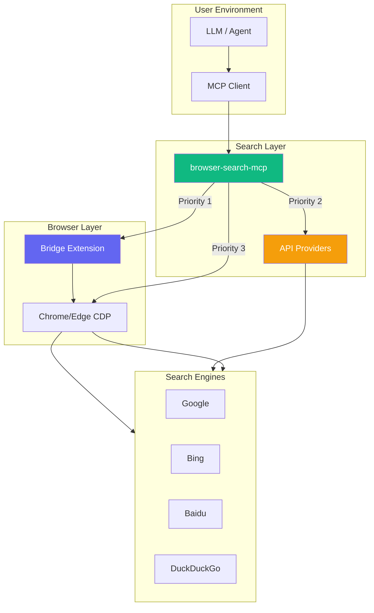

# Browser Search MCP

> 基于真实浏览器的 MCP 搜索引擎服务器 - 让任何支持 MCP 的大模型都能搜索网页内容。
> Browser Search MCP - Web search via real browser for any LLM.

[](https://github.com/fangsylar-pixel/browser-search)
[](https://github.com/fangsylar-pixel/browser-search/blob/main/LICENSE)
[](https://www.python.org/)
[](https://pypi.org/project/browser-search-mcp/)

Built on the same CDP extension bridge architecture as **[browser-takeover-bridge](https://github.com/fangsylar-pixel/browser-takeover-bridge)**.

## Why?

Local LLMs (Ollama, etc.) cant search the web. HTTP-based search tools get blocked by anti-bot measures.
This project uses a **real browser** to search - no API keys, no blocking, no fake results.

## Quick Start

```bash
pip install browser-search-mcp

# Start the MCP server
browser-search-mcp
```

Then configure in any MCP client:

```json
{
  "mcpServers": {
    "browser-search": {
      "command": "browser-search-mcp"
    }
  }
}
```


## Bridge Integration (browser-takeover extension)

When installed alongside the [browser-takeover-bridge](https://github.com/fangsylar-pixel/browser-takeover-bridge) extension, browser-search-mcp automatically detects the extension and routes searches through it instead of launching a headless CDP browser.

**Why use the bridge?**

* **Authenticated sessions** - search while logged into services (e.g., intranet, social media, internal tools)
* **Faster startup** - no need to launch a new browser; reuses the extension's existing connection
* **Lower resource usage** - share one browser session instead of spawning a separate headless instance

**How it works:**

`
LLM/Agent -> MCP Client -> browser-search-mcp -> bridge (extension) -> user's browser -> search engine
`

The bridge check runs automatically at startup. If the extension is not detected, the server falls back to the standard CDP path (launching its own browser). No configuration needed.

**Detection:** Run web_search_status to see if the bridge is active:
`json
{
  "bridge": {
    "available": true,
    "search_available": true
  }
}
`


## Quick Demo

Search the web in seconds from any MCP-compatible LLM:

```bash
pip install browser-search-mcp
browser-search-mcp
```

**Live search result** (Bing, ~5s):

```json
[
  {
    "title": "What is the Model Context Protocol (MCP)?",
    "url": "https://modelcontextprotocol.io/",
    "snippet": "MCP is an open standard for connecting AI applications to external systems."
  },
  {
    "title": "MCP Server Guide",
    "url": "https://example.com/mcp-guide",
    "snippet": "Complete guide to setting up MCP servers for web search."
  },
  {
    "title": "Browser Search MCP",
    "url": "https://github.com/fangsylar-pixel/browser-search",
    "snippet": "Open source MCP server using real browser for web search."
  }
]
```

> **No API keys required. No blocking. Just a real browser doing real searches.**
## Features

| Feature | Status | Description |
|---------|--------|-------------|
| Google, Bing, Baidu, DuckDuckGo | Yes | DOM + JS extraction |
| Persistent browser session | Yes | Reuses CDP connection |
| Result caching | Yes | LRU with configurable TTL |
| Config file | Yes | JSON + env vars |
| Auto-reconnect | Yes | Transparent reconnection |
| browser-takeover bridge | Yes | Auto-detected extension bridge |
| CAPTCHA detection | Yes | Auto fallback on CAPTCHA |
| Engine fallback | Yes | Automatic on failure/CAPTCHA |
| Deep mode | Yes | Auto-extracts top 2 result content |
| Pagination | Yes | Multi-page search support |
| Time filters | Yes | hour/day/week/month/year |
| Engine health check | Yes | Tracks per-engine availability |
| Cross-engine dedup | Yes | Deduplicate multi-engine results |
| API providers (Tavily/Brave) | Yes | Faster, API-key based |
| HTTP API | Yes | FastAPI + OpenAI compatible |
| Codex plugin | Yes | Auto-install as Codex plugin |
| Fallback parsers | Yes | Text-based when JS fails |
| Retry on failure | Yes | Exponential backoff |

## MCP Tools

| Tool | Description |
|------|-------------|
| `web_search` | Search a single engine, returns JSON results |
| `web_search_multi` | Search multiple engines simultaneously |
| `web_search_read_page` | Read full content of a search result URL |
| `web_search_status` | Check browser, bridge, and cache status |
| `web_search_discover_browsers` | Find CDP-enabled browsers |

## Configuration

Config file: `~/.browser-search-mcp/config.json`

### Browser Mode (default)

```json
{
  "browser": {
    "name": "edge",
    "headless": false,
    "port": 9222
  },
  "cache": {
    "enabled": true,
    "ttl": 300
  }
}
```

### API Mode (faster, needs API key)

```json
{
  "provider": {
    "name": "tavily",
    "tavily_api_key": "tvly-your-key-here"
  }
}
```

### Environment Variables

| Variable | Example | Description |
|----------|---------|-------------|
| `BROWSER_SEARCH_HEADLESS` | `true` | Run browser headless |
| `BROWSER_SEARCH_PROVIDER` | `tavily` | Choose provider: browser/tavily/brave |
| `BROWSER_SEARCH_TAVILY_KEY` | `tvly-xxx` | Tavily API key |
| `BROWSER_SEARCH_BRAVE_KEY` | `...` | Brave Search API key |
| `BROWSER_SEARCH_CACHE_TTL` | `300` | Cache TTL in seconds |
| `BROWSER_SEARCH_DEFAULT_ENGINE` | `bing` | Default search engine |
| `BROWSER_SEARCH_BROWSER` | `edge` | Browser executable name |

## How It Works

```text
LLM/Agent -> MCP Client -> browser-search-mcp -> Browser (CDP) -> Search Engine
                                                    | (optional)
                                          browser-takeover extension
```

1. MCP server finds or launches a Chrome/Edge browser with remote debugging
2. Navigates to the search engine
3. Extracts structured results via JavaScript DOM parsing
4. Returns title, url, snippet as JSON
5. Results cached for 5 minutes by default

## Project Structure

```text
browser-search-mcp/
  browser_search_mcp/
    config.py    Configuration via JSON file + env vars
    cdp.py       CDP browser control with persistent sessions
    bridge.py    Browser-takeover extension bridge client
    search.py    Search orchestration with caching and retry
    parsers.py   Text-based search result parsers (fallback)
    bridge_provider.py  Bridge-based search provider (optional, auto-detected)
    providers.py API search providers (Tavily, Brave)
    server.py    FastMCP server with 5 search tools
    http_api.py  HTTP API server (FastAPI + OpenAI-compatible endpoint)
    setup_assistant.py  Prerequisites check
  .codex-plugin/ Codex plugin packaging
  .github/      CI and issue templates
  website/      Promotional website (GitHub Pages)
  README.md, CONTRIBUTING.md, LICENSE, SUPPORT.md
```

## Requirements

- Python 3.11+
- Chrome or Edge installed
- Optional: browser-takeover-bridge extension (for authenticated sessions)

## License

MIT


## Architecture


## Support

If this project helps you, optional support is welcome:

[Support on Afdian](https://afdian.com/a/fangsylar)

Bug reports and contributions are welcome. See [CONTRIBUTING.md](CONTRIBUTING.md) and [SUPPORT.md](SUPPORT.md).
